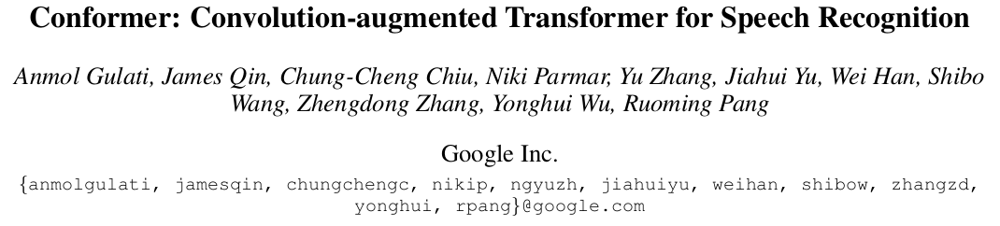

# Conformer
<p align="center">
    <a href="https://colab.research.google.com/drive/13Kn7FWDAOWMhAeqeSsPMHlJpoI40tw9t">
    </a>
    <a href="https://github.com/thanhtvt/conformer/blob/master/LICENSE">
        
    </a>
</p>

<p  align="center"></p>

# About
This is the implementation of Conformer [[1]](#1) in Tensorflow 2  
  
*Note: This repository is still in development and constantly evolving. New features and updates will appear over time.*  
  
# Motivation
I have seen many Conformer's implementations ([[2]](#2), [[3]](#3)) but none of them is in Tensorflow. Therefore, I wanted to challenge myself to implement this model in my favorite framework.  
  
# Installation  
You should have Python 3.7 or higher. I highly recommend creating a virual environment like venv or conda.  
  
The main part of this project uses only [Tensorflow 2](https://www.tensorflow.org/install). However, I also use [Tensorflow I/O](https://www.tensorflow.org/io) for features augmentation (which is not needed right now)  
  
Script for downloading dependencies (*`setuptools` is not available right now*)
  
```bash
pip install tensorflow
pip install tensorflow-io   # optional
```
  
# Usage  
```python
import tensorflow as tf
from conformer import Conformer

batch_size, seq_len, d_model = 3, 15, 512

model = Conformer(
    num_conv_filters=[512, 512], 
    num_blocks=1, 
    encoder_dim=512, 
    num_heads=8, 
    dropout_rate=0.4, 
    num_classes=10, 
    include_top=True
)

# Get sample input
inputs = tf.expand_dims(inputs, axis=1)

# Convert to 4-dimensional tensor to fit Conv2D
inputs = tf.random.uniform((batch_size, seq_len, d_model),
                            minval=-40,
                            maxval=40)

# Get output
outputs = model(inputs)     # [batch_size, 1, seq_len, num_class]
outputs = tf.squeeze(outputs, axis=1)
```
  
# Reference  
<a id="1">[1]</a> 
Conformer: Convolution-augmented Transformer for Speech Recognition [🔗](https://arxiv.org/abs/2005.08100)  
  
<a id="2">[2]</a> 
@[sooftware](https://github.com/sooftware)'s PyTorch implementation [🔗](https://github.com/sooftware/conformer/)
  
<a id="3">[3]</a> 
@[jaketae](https://github.com/jaketae)'s PyTorch implementation [🔗](https://github.com/jaketae/conformer/)